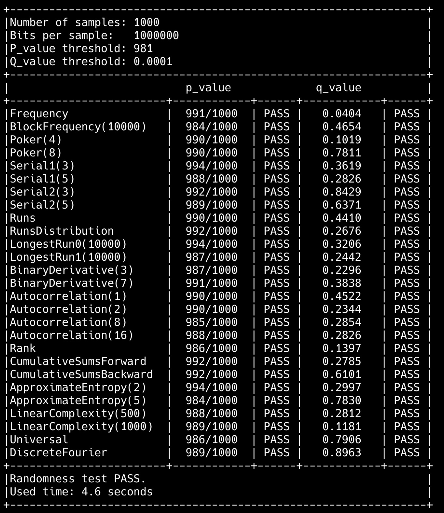
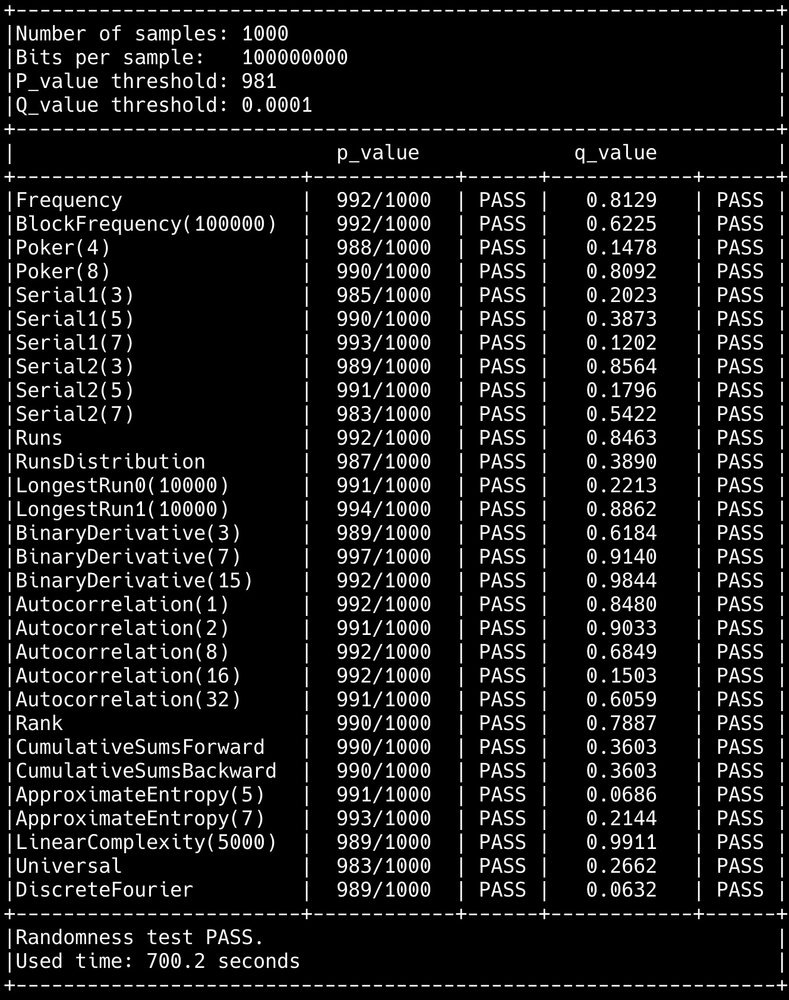

# opengm_rts
opengm_rts is the fast randomness test suits following the GM/T 0005-2021 Randomness test specification.

A lightweight command line executable program is provided to test for 1000 samples with one million bits each.

opengm_rts是随机数检测函数库, 遵循GM/T 0005-2021 随机性检测规范.

包括15个随机性测试函数以及命令行程序,方便对1000组1百万比特的样本进行随机性测试, 应用程序也可通过定制api调用实现开机检测和周期检测.

图形界面程序见https://github.com/opengm-libs/opengm_rts_gui

# Build & Usage
Build the command line executable:
```
cargo build --bin opengm_rts --release
```

The command line executable program:
```
$ ./opengm_rts <dir/to/samples>
```

# Performance
1000组,每组100万比特测试数据, Macbook M1 Max上多线程5秒内完成.

1000组,每组1亿比特测试数据, Macbook M1 Max上多线程716秒完成.




# 测试数据
## 100万比特检测

对e的前100万比特检测结果.

| | 参数 | p-value | q-value |
| - | - | - | - |
|Frequency | - | 0.953748 | 0.476874 |
|BlockFrequency | 10000 | 0.676226 | 0.676226 |
|Poker | 8 | 0.023946 | 0.023946 |
|Serial1 | 5 | 0.225782 | 0.225782 |
|Serial2 | 5 | 0.057499 | 0.057499 |
|Runs | - | 0.561916 | 0.719041 |
|RunsDistribution | - | 0.772411 | 0.772411 |
|LongestRun0 | - | 0.437860 | 0.437860 |
|LongestRun1 | - | 0.718354 | 0.718354 |
|BinaryDerivative | 7 | 0.760365 | 0.619817 |
|Autocorrelation | 16 | 0.912408 | 0.543795 |
|Rank | - | 0.307543 | 0.307543 |
|CumulativeSumsBackward | - | 0.724265 | 0.724265 |
|CumulativeSumsForward | - | 0.669886 | 0.669886 |
|ApproximateEntropy | 5 | 0.361687 | 0.361687 |
|LinearComplexity | 1000 | 0.844720 | 0.844720 |
|Universal | - | 0.282567 | 0.141283 |
|DiscreteFourier | - | 0.851010 | 0.425505 |

## 1亿比特检测
对 sm3(0x00000001) || sm3(0x00000002) || ... || sm3(0x0005f5e1)的检测结果.

> 注: 采用大端表示,即0x00000001表示为4个字节: [0x00, 0x00, 0x00, 0x01].

| | 参数 | p-value | q-value |
| - | - | - | - |
|Frequency| - |  0.369291 | 0.184645 |
|BlockFrequency| 100000 | 0.100391 | 0.100391 |
|Poker| 4 | 0.279315 | 0.279315 |
|Poker| 8 | 0.921122 | 0.921122 |
|Serial1| 3 | 0.356591 | 0.356591 |
|Serial1| 5 | 0.184023 | 0.184023 |
|Serial1| 7 | 0.177479 | 0.177479 |
|Serial2| 3 | 0.361706 | 0.361706 |
|Serial2| 5 |0.108221 | 0.108221 |
|Serial2| 7 | 0.331672 | 0.331672 |
|Runs| - |  0.214118 | 0.892940 |
|RunsDistribution| - |  0.136170 | 0.136170 |
|LongestRun0| 10000 | 0.951972 | 0.951972 |
|LongestRun1| 10000 | 0.503703 | 0.503703 |
|BinaryDerivative| 3 | 0.975508 | 0.487754 |
|BinaryDerivative| 7 | 0.606901 | 0.696549 |
|BinaryDerivative| 15 | 0.899019 | 0.449509 |
|Autocorrelation| 1 | 0.214051 | 0.892974 |
|Autocorrelation| 2 | 0.298153 | 0.149076 |
|Autocorrelation| 8 | 0.419550 | 0.209775 |
|Autocorrelation| 16 | 0.118146 | 0.059073 |
|Autocorrelation| 32 | 0.116368 | 0.941815 |
|Rank| - |  0.900557 | 0.900557 |
|CumulativeSumsBackward| - |  0.715149 | 0.715149 |
|CumulativeSumsForward| - |  0.310534 | 0.310534 |
|ApproximateEntropy| 5 | 0.172294 | 0.172294 |
|ApproximateEntropy| 7 | 0.243197 | 0.243197 |
|LinearComplexity| 5000 | 0.128996 | 0.128996 |
|Universal| - |  0.589902 | 0.294951 |
|DiscreteFourier| - |  0.838827 | 0.580586 |

# About
OpenGM is the (ongoing) open-source project for the GM/T standards.